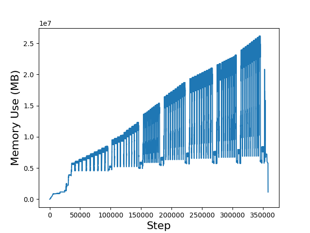

# mperf
Using the dynamic library piling method to perform library piling on the *malloc* *calloc* *realloc* *free* function can achieve memory analysis.


## How to use？

Assume the file is located in `/home/usr/mperf`

### COMPILE

Easily compile the code using `compile.sh` script

```bash
cd ./code
sh compile.sh
```

### RUN

Add  `LD_PRELOAD = your_pth/mperf.so`  before run `run.sh` script 
```bash
LD_PRELOAD=/home/usr/mperf/code/mperf.so ./run.sh
```

### ANALYSE

Visual processing can be done using the provided python script

```bash
LD_PRELOAD=/home/usr/mperf/code/mperf.so ./run.sh | python /home/usr/mperf/draw/dispatch.py

python /home/usr/mperf/draw/draw.py
```
After that can get an output like this:



ps. If do not output the function call stack information, please use `./code/mperf_less.cc` instead, it will greatly reduce the running time and the size of the generated analysis file.

Library Interpositioning (CSAPP):

https://hansimov.gitbook.io/csapp/part2/ch07-linking/7.13-library-interpositioning